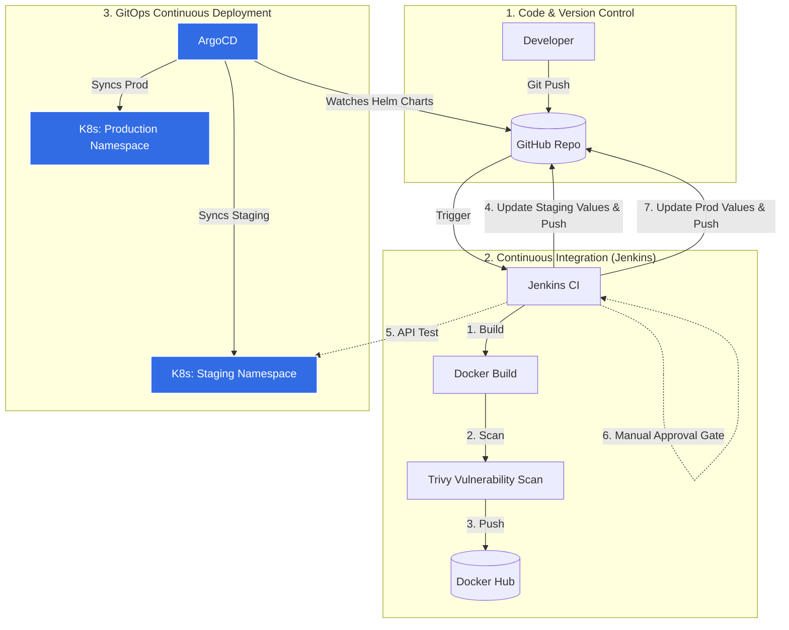

# Enterprise DevSecOps CI/CD Pipeline

This project demonstrates a production-grade, end-to-end CI/CD pipeline for a Python Flask application. It utilizes a modern **GitOps** deployment strategy, leveraging **Helm** and **ArgoCD** to manage multi-environment deployments (Staging and Production) on a Kubernetes cluster. 

The pipeline includes security scanning, automated testing, and a manual approval gate for production releases.

##  Architecture



##  Key Features

* **GitOps Deployment Workflow**: Deployment state is declared in Git using Helm values. Jenkins no longer needs direct access to the Kubernetes cluster API (`kubectl`). Instead, it pushes configuration changes to Git, and **ArgoCD** reconciles the cluster state.
* **Helm Templating**: Kubernetes manifests are packaged as a Helm chart, enabling dynamic configurations across different environments (`values-staging.yaml`, `values-prod.yaml`).
* **Multi-Environment Pipeline**: The pipeline deploys to a **Staging** namespace first, runs automated API tests, and pauses for a **Manual Approval** before deploying to the **Production** namespace.
* **DevSecOps (Security Scanning)**: Integrated **Trivy** image scanning detects HIGH and CRITICAL vulnerabilities before pushing to the registry.
* **Parallel Execution**: Demonstrated parallel build and legacy deployment stages to optimize pipeline duration.
* **Dockerized**: The application is containerized using Alpine Linux to minimize the image footprint and attack surface.

##  Technology Stack

* **Backend Framework:** Python, Flask
* **Containerization:** Docker
* **CI/CD Orchestration:** Jenkins (Declarative Pipeline)
* **Container Orchestration:** Kubernetes
* **GitOps Continuous Delivery:** ArgoCD
* **Package Management:** Helm
* **Security:** Aqua Security Trivy

##  Project Structure

```
├── app.py                      # Main Flask application
├── Dockerfile                  # Docker configuration using Alpine Linux
├── Jenkinsfile                 # Declarative Jenkins CI/CD Pipeline
├── requirements.txt            # Python dependencies
├── templates/                  # HTML templates
│   └── index.html              # Main UI
├── helm/                       # Helm Chart directory
│   └── flaskapp/               
│       ├── Chart.yaml          # Helm chart metadata
│       ├── values.yaml         # Default base configurations
│       ├── values-staging.yaml # Staging environment overrides (NodePort: 30001)
│       ├── values-prod.yaml    # Production environment overrides (NodePort: 30002)
│       └── templates/          # Templated Deployment & Service manifests
└── argocd/                     
    └── applications.yaml       # ArgoCD Application CRDs for Staging and Prod
```

##  Setup & Installation

### Local Development

1. **Clone the repository:**
   ```bash
   git clone https://github.com/2coolkalamkaar/jenkins-pipeline-.git
   cd jenkins-pipeline-
   ```
2. **Create a Virtual Environment & Install Dependencies:**
   ```bash
   python3 -m venv venv
   source venv/bin/activate
   pip install -r requirements.txt
   ```
3. **Run the App:**
   ```bash
   python app.py
   ```
   Access at `http://localhost:5000`.

### Kubernetes & GitOps Setup

1. **Install ArgoCD on your Cluster:**
   ```bash
   kubectl create namespace argocd
   kubectl apply -n argocd -f https://raw.githubusercontent.com/argoproj/argo-cd/stable/manifests/install.yaml
   ```
2. **Create Target Namespaces:**
   ```bash
   kubectl create namespace flaskapp-staging
   kubectl create namespace flaskapp-prod
   ```
3. **Deploy ArgoCD Applications:**
   This links ArgoCD to the Helm chart in the GitHub repository.
   ```bash
   kubectl apply -f argocd/applications.yaml
   ```

##  Jenkins Pipeline Walkthrough

The `Jenkinsfile` executes the following sequence:

1. **Setup & Package**: Validates Python dependencies and zips legacy code.
2. **Parallel Stage**: 
   - **Deploy to Prod (Legacy):** Securely copies code via SCP and restarts a systemd service.
   - **Build Docker Image:** Builds the container using the Dockerfile.
3. **Trivy Image Scan:** Spins up an ephemeral Trivy container to scan the newly built image against the latest CVE databases.
4. **Push to Docker Hub:** Authenticates securely using Jenkins credentials and pushes the tagged image.
5. **Deploy to Staging (GitOps):** Uses `sed` to update the image tag in `helm/flaskapp/values-staging.yaml`, commits the file to Git, and pushes. ArgoCD detects the commit and deploys to the `flaskapp-staging` namespace.
6. **Test Staging:** Waits for ArgoCD to sync, then runs an automated API `curl` test against the staging NodePort to verify a `200 OK` response.
7. **Approval Gate:** The pipeline halts, awaiting manual approval from a release manager.
8. **Deploy to Prod (GitOps):** Upon approval, updates the image tag in `helm/flaskapp/values-prod.yaml`, commits, and pushes. ArgoCD detects the change and deploys the release to the `flaskapp-prod` namespace.

---
*Architected and maintained by Rahul*
